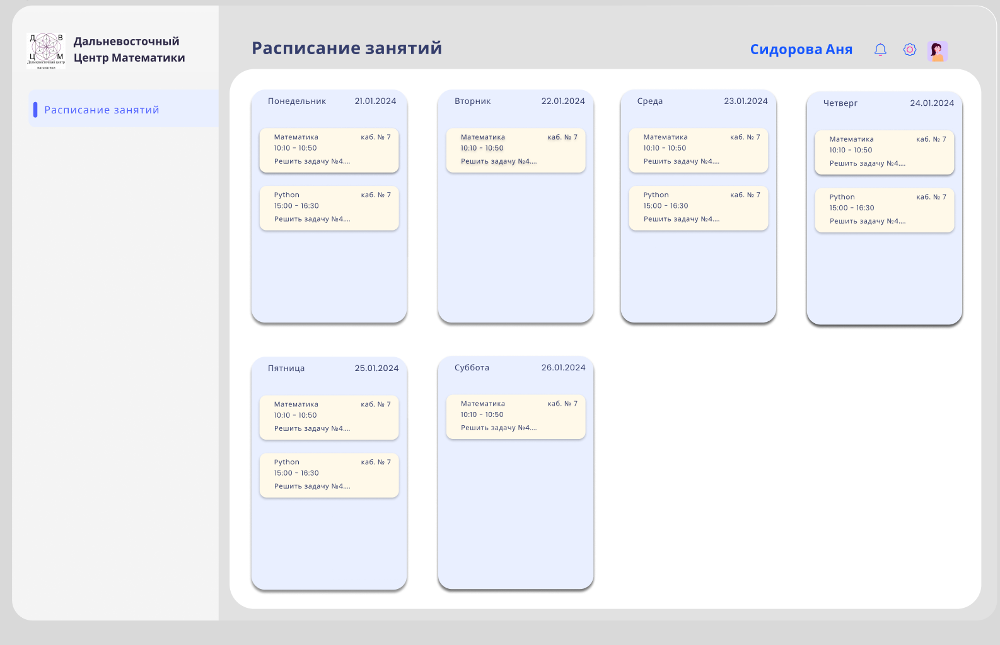
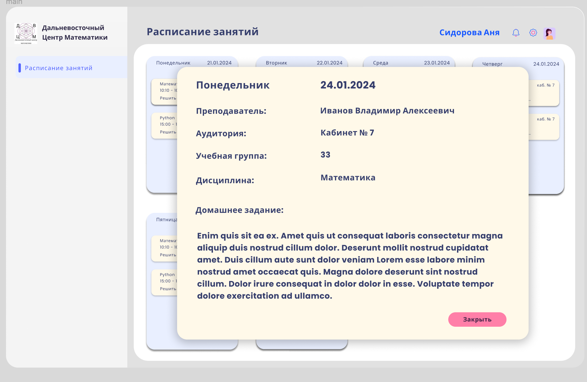
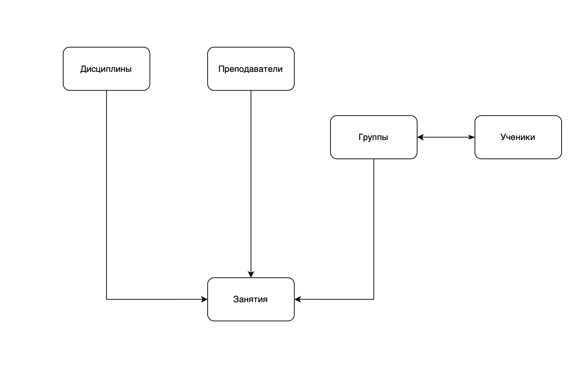
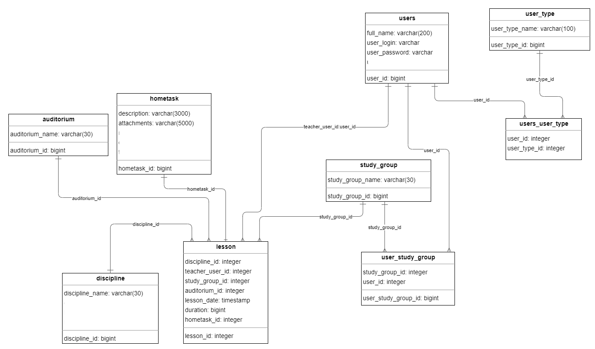

# schedule-service

### Run
    docker-compose up -d   
    go run cmd/app/main.go

### Введение

 Онлайн-сервис «Система расписания занятий» предназначен ведения расписания занятий с домашними заданиями в Дальневосточном Центре Математики.  

 Данный онлайн-сервис позволяет решить следующие проблемы, связанные с расписанием занятий:  
 * Решает проблему сложности координации расписания между студентами и преподавателями.
 * Упрощает процесс управления изменениями в расписании.
 * Предоставляет централизованное место для просмотра и обновления расписания.
 * Избавляет от необходимости физического присутствия для уточнения расписания занятий.
 * Позволяет студентам легко найти домашние задания и материалы курса.  
  

### 1. Проектирование online-сервиса

 #### 1. Описание предметной области «Система расписания занятий»
 В центре математики проводятся занятия по математике для школьников, студентов и всех интересующихся, а также курсы по повышению квалификации для учителей.
 Поскольку в Дальневосточном центре математики происходит взаимодействие студентов и преподавателей, то им необходимо обмениваться учебной информацией. Сейчас такой обмен происходит через администратора - преподаватель передает информацию, которая затем передается студентам и наоборот. Домашние задания преподаватель вынужден лично передавать студентам, в случае если они не присутствовали на занятиях, либо через администратора.  Занятие могут быть перенесены или отменены из-за погодных условий, болезни преподавателя и других инцидентов. Администратору приходится самостоятельно уведомлять каждую учебную группу.  
 Сейчас в учебном центре с каждым годом наблюдается прирост количества обучающихся. 
 Поскольку количество учеников растёт, то администратору приходится вести взаимодействие со всеми учебными группами одновременно. Как следствие происходят случаи, когда администратор забывает передать какое-либо домашнее задание или информацию об изменении в расписании занятий.  
 Данные проблемы снижают производительность учебного центра, поэтому было решено разработать систему, позволяющую решить рассмотренные выше проблемы.

#### 1.2 Исследования: метод персонажа
 1. Администратор 

    | Характеристика                                                                            | Что делает                    | Что для него важно                               |
    | ----------------------------------------------------------------------------------------- | ----------------------------- | ------------------------------------------------ |
    | Человек, работающий в учебном центре в качестве администратора в возрасте от 20 до 75 лет | Составляет расписание занятий | Составлять/изменять/удалять занятия в расписании |
  
 2. Преподаватель  
   
    | Характеристика                                                                           | Что делает              | Что для него важно                                      |
    | ---------------------------------------------------------------------------------------- | ----------------------- | ------------------------------------------------------- |
    | Человек, работающий в учебном центре в качестве преподавателя в возрасте от 20 до 75 лет | Задает домашние задания | Составлять/изменять/удалять домашние задания к занятиям |

 3. Обучающийся  
   
    | Характеристика                                                   | Что делает                                                               | Что для него важно                                                    |
    | ---------------------------------------------------------------- | ------------------------------------------------------------------------ | --------------------------------------------------------------------- |
    | Человек, обучающийся в учебном центре в возрасте от 10 до 18 лет | Посещает занятия, просматривает расписание занятий с домашними заданиями | Иметь актуальную информацию о расписаниии занятий и домашних заданиях |

#### 1.3 Сценарии использования приложения

  Сценарий использования администратором  
    

  Сценарий использования преподавателем  
    

  Сценарий использования обучающимся  
    

#### 1.4 Прототипы интерфейса

Пример окна **Авторизация**

Пример окна **Расписание занятий** для обучающегося

Пример просмотра домашнего задания и информации о занятии для обучающегося

#### 1.5 Проектирование базы данных

  В результате анализа предметной области **Расписание занятий** можно выделить следующие информационные объекты:
  1. Преподаватель
  2. Ученики
  3. Дисциплины
  4. Учебные группы
  5. Занятие  
   
  На основе выделенных объектов можно получить следующую концептуальную модель, демонстрирующую связи между объектами:
     

  Для каждого информационного объекта необходимо сопоставить табличное представление, которое затем должно быть приведено к третьей нормальной форме.  
  Таким образом, была получена следующая логическая модель:
  

### 2.    Реализация приложения

#### 2.1. Функциональные возможности
  Онлайн-сервис **Система расписания занятий** должен:
  1. Обеспечить администраторам возможность добавлять, удалять, изменять занятия;
  2. Обеспечить преподавателям возможность добавлять, удалять, изменять домашние задания;
  3. Обеспечить обучающимся возможность просматривать расписание занятий с домашними заданиями.
   
#### 2.2. Выбор средств реализации

Онлайн-сервис **Система расписания занятий** основан на шаблоне MVC, который позволяет отделить бизнес-логику от пользовательского интерфейса. В проекте использовались мощные инструменты, такие как веб-фреймворк Echo, база данных PostgreSQL, ORM GORM и система аутентификации Keycloak.

Echo - это легковесный веб-фреймворк, написанный на языке программирования Golang. Он обеспечивает высокоуровневый функционал для быстрого и удобного создания веб-приложений.

PostgreSQL - это мощная и масштабируемая система управления базами данных, которая обеспечивает надежное хранение данных.

GORM - это ORM (Object-Relational Mapping) для Golang, который позволяет удобно работать с базой данных, предоставляя абстракцию от конкретного SQL-синтаксиса и упрощая процесс создания запросов.

Keycloak - это система аутентификации и единый вход, которая обеспечивает безопасность и контроль доступа к приложению.

В рамках микросервисной архитектуры, проект **Система расписания занятий**  делится на отдельные сервисы, каждый из которых отвечает за определенную функциональность. Это позволяет упростить разработку, ускорить внедрение изменений и повысить масштабируемость приложения.

Таким образом, в данном проекте комбинация Echo, GORM, Keycloak и PostgreSQL обеспечивает максимальную эффективность, безопасность и удобство разработки, отвечая потребностям сложных веб-приложений в рамках микросервисной архитектуры.