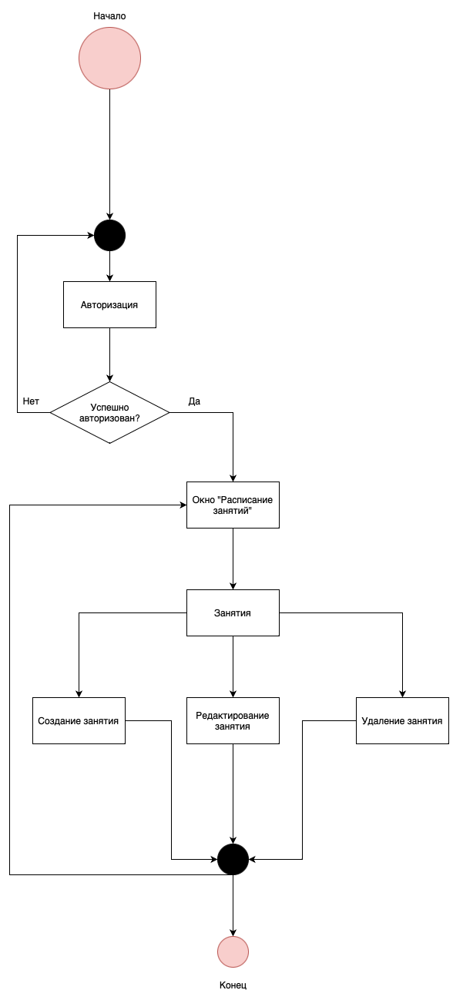
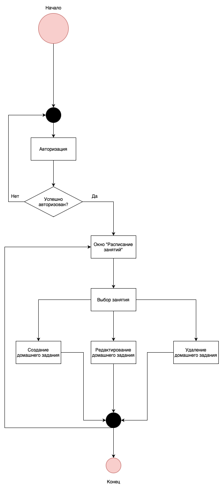
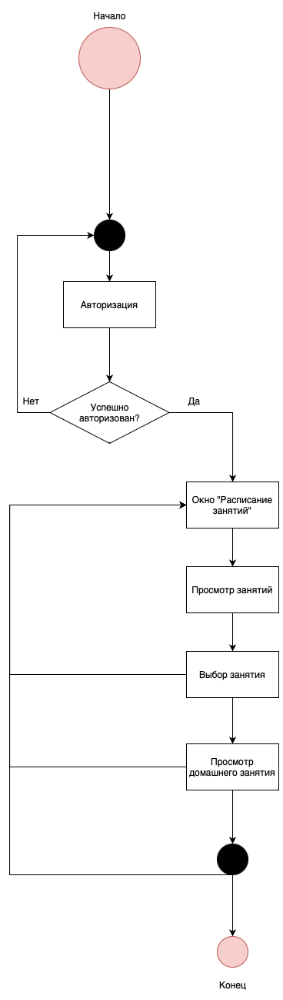

# schedule-service

### Run
    docker-compose up -d   
    go run cmd/app/main.go

### Введение

 Онлайн-сервис «Система расписания занятий» предназначен ведения расписания занятий с домашними заданиями в Дальневосточном Центре Математики.  

 Данный онлайн-сервис позволяет решить следующие проблемы, связанные с расписанием занятий:  
 * Решает проблему сложности координации расписания между студентами и преподавателями.
 * Упрощает процесс управления изменениями в расписании.
 * Предоставляет централизованное место для просмотра и обновления расписания.
 * Избавляет от необходимости физического присутствия для уточнения расписания занятий.
 * Позволяет студентам легко найти домашние задания и материалы курса.  
  

### 1. Проектирование online-сервиса

 #### 1. Описание предметной области «Система расписания занятий»
 В центре математики проводятся занятия по математике для школьников, студентов и всех интересующихся, а также курсы по повышению квалификации для учителей.
 Поскольку в Дальневосточном центре математики происходит взаимодействие студентов и преподавателей, то им необходимо обмениваться учебной информацией. Сейчас такой обмен происходит через администратора - преподаватель передает информацию, которая затем передается студентам и наоборот. Домашние задания преподаватель вынужден лично передавать студентам, в случае если они не присутствовали на занятиях, либо через администратора.  Занятие могут быть перенесены или отменены из-за погодных условий, болезни преподавателя и других инцидентов. Администратору приходится самостоятельно уведомлять каждую учебную группу.  
 Сейчас в учебном центре с каждым годом наблюдается прирост количества обучающихся. 
 Поскольку количество учеников растёт, то администратору приходится вести взаимодействие со всеми учебными группами одновременно. Как следствие происходят случаи, когда администратор забывает передать какое-либо домашнее задание или информацию об изменении в расписании занятий.  
 Данные проблемы снижают производительность учебного центра, поэтому было решено разработать систему, позволяющую решить рассмотренные выше проблемы.

#### 1.2 Исследования: метод персонажа
 1. Администратор 

    | Характеристика                                                                            | Что делает                    | Что для него важно                               |
    | ----------------------------------------------------------------------------------------- | ----------------------------- | ------------------------------------------------ |
    | Человек, работающий в учебном центре в качестве администратора в возрасте от 20 до 75 лет | Составляет расписание занятий | Составлять/изменять/удалять занятия в расписании |
  
 2. Преподаватель  
   
    | Характеристика                                                                           | Что делает              | Что для него важно                                      |
    | ---------------------------------------------------------------------------------------- | ----------------------- | ------------------------------------------------------- |
    | Человек, работающий в учебном центре в качестве преподавателя в возрасте от 20 до 75 лет | Задает домашние задания | Составлять/изменять/удалять домашние задания к занятиям |

 3. Обучающийся  
   
    | Характеристика                                                   | Что делает                                                               | Что для него важно                                                    |
    | ---------------------------------------------------------------- | ------------------------------------------------------------------------ | --------------------------------------------------------------------- |
    | Человек, обучающийся в учебном центре в возрасте от 10 до 18 лет | Посещает занятия, просматривает расписание занятий с домашними заданиями | Иметь актуальную информацию о расписаниии занятий и домашних заданиях |

#### 1.3 Сценарии использования приложения

  Сценарий использования администратором  
    
  Сценарий использования преподавателем  
    
  Сценарий использования обучающимся  
    

#### 1.4 Прототипы интерфейса (стр. 25-34)

#### 1.5 Проектирование базы данных

концептуальная и логическая модель данных (стр. 35-37, подробнее – лекция 1)
описание процессов обработки информации (стр. 38-39)
### 1.    Реализация приложения

#### 2.1. Функциональные возможности (стр. 40)

#### 2.2. Выбор средств реализации

…

### Заключение